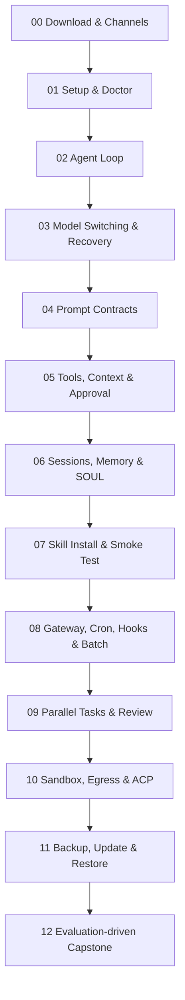

# Hermes Learning Lab 课程体系

## 教学目标

完成课程后，学习者应能独立完成安装诊断、可靠 Prompt、工具与上下文治理、扩展安装、自动化、委派、安全执行、模型推理评测和生产工作流设计。

每课使用同一规范，定义内容只保留到足以支持操作决策：

1. 先修条件和可验证目标
2. 不计分课前诊断
3. 四个递进操作与可观察 Agent 轨迹
4. 实验 Task、Input、Procedure、Success Criteria
5. 逐项结果核验、应保存证据和失败恢复动作
6. 可判定课后检查与针对性反馈
7. 官方事实源和按课匹配的社区延伸阅读

## 知识递进

## 课程地图

| 课 | 等级 | 核心问题 | 实验交付物 |
|---:|---|---|---|
| 00 | Beginner | macOS/Windows/WSL2 如何安装并接入桌面与飞书？ | 多端安装、真实界面地标、Desktop/Feishu 回执与审批记录 |
| 01 | Beginner | 如何证明 Hermes 基础环境可用？ | Setup/首次聊天/Doctor 验收记录 |
| 02 | Beginner | Agent 如何从意图进入行动闭环？ | 只读盘点与单次写入审批记录 |
| 03 | Beginner | 如何切换模型并在失败后快速回退？ | 同题 A/B 测试与恢复记录 |
| 04 | Beginner | 如何把模糊请求变成可验收契约？ | JSON Schema 仓库报告 Prompt |
| 05 | Intermediate | 如何最小化工具和上下文攻击面？ | README 草稿与权限证据 |
| 06 | Intermediate | 什么信息应进入 Session、Memory 或 SOUL？ | 脱敏调试 Memory |
| 07 | Intermediate | 如何搜索、审查、安装并卸载 Skill？ | 隔离 Profile 中的 Skill 冒烟测试 |
| 08 | Intermediate | 自动化如何做到幂等和可追踪？ | 工作日早报与失败历史 |
| 09 | Intermediate | 如何在真实会话中观察并收口并行任务？ | `/agents` 状态与集成验证记录 |
| 10 | Advanced | 如何隔离文件、进程、网络和秘密？ | Docker + Egress 负向测试 |
| 11 | Advanced | 如何在升级或换机前留下可验证恢复点？ | 完整备份、归档校验与隔离恢复记录 |
| 12 | Advanced | 如何交付可审计生产工作流？ | PR 审查 Agent 运行手册与评测报告 |

## 掌握标准

- 课前诊断只记录 `correct` 或 `review`，不锁定内容。
- 实验结果核验与课后检查都通过后，课程才计入双证据掌握度。
- 浏览器通过只证明关键判断正确；真实实验还需满足每课 Success Criteria。
- Lesson 00 的本机状态检测必须由学习者显式触发，只返回安装、进程与 Gateway 三类布尔状态。
- 真实回执不得包含 App Secret、Token、用户 ID、聊天历史或个人路径。
- 毕业标准建议为：13 个课后检查通过、13 个实验验收完成、毕业项目评测与回滚演练通过。

## 内容维护规范

- 命令和配置键必须指向当前官方资料。
- 模型参数必须注明来源和“评测后调整”。
- 示例不包含真实 Token、个人路径或生产消息目标。
- 每个副作用步骤要有权限范围、成功证据和恢复方式。
- 新增课程时同步更新 `src/data.js`、`resources/LESSON-MAP.md`、本文件、README 路线和链接检查。
