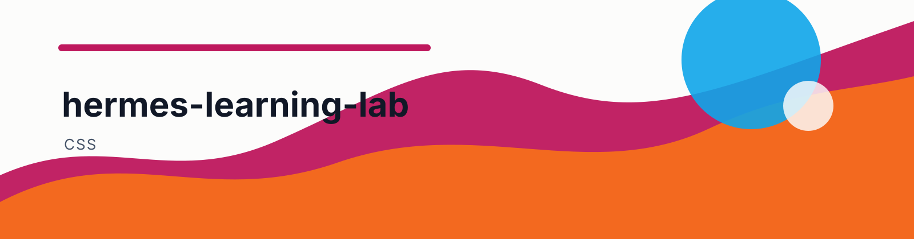
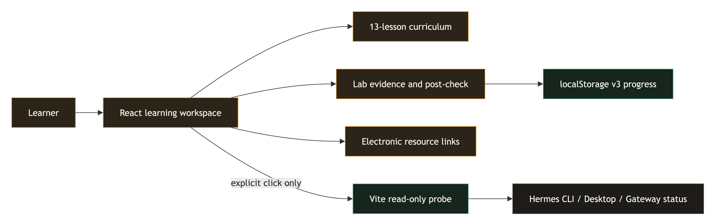

<a id="readme-top"></a>

<!-- README-ARCHITECT: visual-shell -->
<p align="center">
  
</p>
<p align="center">
  <a href="https://github.com/ChrysFu/hermes-learning-lab/stargazers"></a>
  <a href="https://github.com/ChrysFu/hermes-learning-lab/commits/main"></a>
  <a href="https://github.com/ChrysFu/hermes-learning-lab/search?l=JavaScript"></a>
</p>
<!-- README-ARCHITECT: visual-shell end -->

<div align="center">

# Hermes Learning Lab

**Learn Hermes by operating it, verifying the result, and recovering from failure.**

[](https://react.dev/)
[](https://vite.dev/)
[](./src/)
[](./CURRICULUM.md)
[](https://github.com/ChrysFu/hermes-learning-lab/actions/workflows/ci-pages.yml)
[](./LICENSE)

[立即开始第一课](https://chrysfu.github.io/hermes-learning-lab/?utm_source=github&utm_medium=readme&utm_campaign=first_lesson) · [课程大纲](./CURRICULUM.md) · [实验手册](./docs/labs/README.md) · [电子资料库](./resources/README.md) · [排错指南](./docs/TROUBLESHOOTING.md)

</div>


<div align="right"><a href="#english">English</a> | <a href="#简体中文">简体中文</a></div>

<a id="english"></a>

## English

<details>
<summary>Table of Contents</summary>

- [Overview](#overview)
- [Highlights](#highlights)
- [Learning Loop](#learning-loop)
- [Learning Path](#learning-path)
- [How to Use](#how-to-use)
- [Online Learning Materials](#online-learning-materials)
- [Architecture](#architecture)
- [Project Structure](#project-structure)
- [Checks and Safety](#checks-and-safety)
- [Community and Contributing](#community-and-contributing)
- [Sources and License](#sources-and-license)

</details>

## Overview

Hermes Learning Lab is a Chinese interactive curriculum for learners new to Hermes Agent. It starts with the real Desktop and Feishu surfaces, then progresses through CLI usage, model switching, prompt contracts, Memory, Skills, automation, delegation, isolation, and recovery.

The course was last verified on **2026-08-08** against [Hermes Agent v0.20.0 (`v2026.8.3`)](https://github.com/NousResearch/hermes-agent/releases/tag/v2026.8.3).

The course adapts the structure of [microsoft/AI-For-Beginners](https://github.com/microsoft/AI-For-Beginners): environment setup and diagnostics come first, followed by self-contained labs with explicit inputs, expected results, post-checks, and further reading. Hermes commands and configuration facts are grounded in the [official documentation](https://hermes-agent.nousresearch.com/docs/) and [official repository](https://github.com/NousResearch/hermes-agent).

> [!NOTE]
> This is an independent community education project, not an official Nous Research or Microsoft product.

## Highlights

| Hands-on learning | Evidence and safety |
|---|---|
| macOS, native Windows, WSL2, and Desktop setup routes | Setup, basic chat, and Doctor establish the first baseline |
| Official Hermes Desktop screenshot with interactive landmarks | Learners submit `DESKTOP_OK`; the course never reads window content |
| Feishu developer-console and client walkthroughs | Covers WebSocket, mentions, typing, approval cards, and error `200340` |
| One progressive 13-lesson path | Theory is reduced to the minimum needed for each operation |
| Pre-check, four operational steps, and a real lab in every lesson | Every lab defines success criteria, evidence, and recovery actions |
| Choices, builders, and interface simulations | Lab verification plus the post-check forms two-part mastery evidence |
| Official references and per-lesson community readings | Community material never replaces official command verification |
| Automatic local progress | `localStorage v3` with migration from v1/v2 |

## Learning Loop

```text
Pre-check
  -> Essential context and core operations
  -> Observable agent trace
  -> Real-environment lab
  -> Result checklist
  -> Evidence capture and recovery rehearsal
  -> Post-check
  -> Official and community references
```

The course shows no estimated lesson durations. A lesson contributes to mastery only after both its real lab and post-check are verified.

## Learning Path

| Phase | Lessons | Evidence produced |
|---|---|---|
| I Setup and Foundations | 00 Download and Channels · 01 Environment and Doctor · 02 Agent Loop · 03 Model Switching and Recovery | Desktop/Feishu receipts, Doctor baseline, read-only tool evidence, model rollback record |
| II Reliable Interaction | 04 Prompt Contracts · 05 Tools/Context/Approval · 06 Sessions/Memory/SOUL | Validated prompt, minimal tool scope, redacted Memory |
| III Extensions and Automation | 07 Skill Install/Smoke Test · 08 Gateway/Cron/Hooks/Batch · 09 Parallel Tasks and Review | Skill review, idempotent automation, `/agents` closure evidence |
| IV Production Engineering | 10 Sandbox/Egress/ACP · 11 Backup/Update/Restore · 12 Capstone | Isolation negative tests, restore rehearsal, evaluation-driven workflow |

See [CURRICULUM.md](./CURRICULUM.md) for prerequisites and mastery criteria, and [docs/labs/README.md](./docs/labs/README.md) for the real-environment evidence template.

## How to Use

### 1. Start online

Open the [GitHub Pages course](https://chrysfu.github.io/hermes-learning-lab/?utm_source=github&utm_medium=readme&utm_campaign=first_lesson) and begin with the Lesson 00 Desktop/Feishu receipt lab. Online mode saves browser progress but never reads Hermes configuration or probes local processes.

> [!NOTE]
> Before the first deployment, set Pages Source to GitHub Actions as described in [GitHub publishing setup](./docs/GITHUB-SETUP.md).

### 2. Start locally

Requirements: Node.js 22+ and npm 10+.

```bash
git clone https://github.com/ChrysFu/hermes-learning-lab.git
cd hermes-learning-lab
npm ci
npm run dev
```

Open the URL printed by Vite, normally `http://127.0.0.1:5173/`. If the port is busy, Vite reports the replacement port.

### 3. Complete a lesson

1. Select a lesson and complete the ungraded pre-check.
2. Follow the agent trace and four core operational steps.
3. Run the real lab in a dedicated directory, test Profile, or Sandbox.
4. Check every item under result verification against the actual outcome.
5. Save the requested redacted evidence and confirm the recovery action is executable.
6. Record the lab verification, then pass the post-check.
7. Continue only after the progress rail confirms both forms of evidence.

### 4. Use the Desktop and Feishu simulations

Lesson 00 includes Desktop and Feishu simulations for sessions, models, mentions, and tool approval. They never connect to a real Hermes runtime. Real verification requires the learner to run the prompt in Desktop or Feishu and explicitly submit a redacted receipt.

### 5. Check local status

Only an explicit click invokes the local Vite probe. It checks whether the Hermes command exists, whether the Desktop process is running, and whether Gateway reports a usable state. It returns booleans only, never paths, configuration, secrets, logs, sessions, or messages.

> [!IMPORTANT]
> GitHub Pages explicitly shows static learning mode and hides the local-probe button. Simulations, receipt verification, resource links, and browser progress still work.

### 6. Build, test, and preview

```bash
npm run lint
npm run build
npm run test:e2e
npm run preview
```

Use `npm run build:pages` to verify the Pages base path. CI reruns the same Playwright flows under `/hermes-learning-lab/`.

## Online Learning Materials

The [resources/](./resources/) folder contains indexes, original summaries, access states, and source links only. It does not copy third-party PDFs, article bodies, or video transcripts.

| Material | Best for | Preview |
|---|---|---|
| Hermes Agent documentation | Current setup, Desktop, Feishu, Skills, Memory, Cron, security | [Open docs](https://hermes-agent.nousresearch.com/docs/) |
| Official Hermes Feishu guide | App permissions, WebSocket, events, approval cards, troubleshooting | [Open Feishu guide](https://hermes-agent.nousresearch.com/docs/user-guide/messaging/feishu) |
| NousResearch/hermes-agent | Current commands, releases, source, implementation boundaries | [Open repository](https://github.com/NousResearch/hermes-agent) |
| Hermes Agent Orange Book 2.0 | Chinese overview of UI, memory, multi-agent workflows, and security | [Preview Chinese PDF](https://github.com/alchaincyf/hermes-agent-orange-book/blob/main/Hermes-Agent%E6%A9%99%E7%9A%AE%E4%B9%A62.0-v260607.pdf) |
| hermes-agent-zh | Chinese setup, providers, automation, messaging, and FAQ | [Open tutorial](https://github.com/dongsheng123132/hermes-agent-zh) |
| awesome-hermes-agent | Skills, plugins, tools, surfaces, and advanced guides | [Open index](https://github.com/0xNyk/awesome-hermes-agent) |
| Full beginner tutorial | Setup, Memory, Subagents, Cron, Skills, backup, firewall | [Watch on YouTube](https://www.youtube.com/watch?v=-EivK7vpOXY) |
| Ten beginner tips | Models, SOUL, Memory, Doctor, UI, migration, Skills | [Watch on YouTube](https://www.youtube.com/watch?v=hLiN_X7dzdw) |
| Desktop release tutorial | Real Windows, macOS, and Linux Desktop UI | [Watch on YouTube](https://www.youtube.com/watch?v=FdSVeOAd480) |

Browse the [resource index](./resources/README.md), [official references](./resources/OFFICIAL.md), [community materials](./resources/COMMUNITY.md), and [lesson map](./resources/LESSON-MAP.md).

> [!NOTE]
> Community videos are for observing interfaces and workflows. Installation commands, configuration keys, permissions, and security behavior are verified against the Hermes documentation and current release. The index excludes sources that require sign-in, are unavailable, or cannot be publicly verified.

## Architecture



The React workspace loads curriculum and resource data from `src/data.js`. Diagnostics, lab verification, post-checks, and the current position are saved in browser `localStorage`. The Vite middleware reaches the read-only local probe only after an explicit click. The editable source is [learning-system.drawio](./assets/readme/learning-system.drawio).

## Project Structure

```text
hermes-learning-lab/
├── .github/                    # CI/Pages and contribution templates
├── src/                         # React learning engine, curriculum data, styles
├── resources/                   # Electronic material indexes and lesson map
├── tests/e2e/                   # Desktop, static-mode, and mobile Playwright checks
├── docs/labs/README.md          # Real-environment lab guide
├── docs/TROUBLESHOOTING.md      # Setup, UI, tooling, and recovery guide
├── docs/GITHUB-SETUP.md         # Pages, Topics, and Discussions setup
├── docs/METRICS.md              # Privacy-first measurement plan
├── docs/adr/                    # Architecture decisions
├── assets/readme/               # README architecture asset and editable source
├── public/ui-reference/         # Attributed official UI reference
├── CURRICULUM.md                # Curriculum and two-part mastery model
├── RESEARCH.md                  # Source research and evidence limits
├── CONTRIBUTING.md              # Contribution and evidence rules
├── LICENSE                      # Dual code/content license
└── preview.png                  # Current product screenshot
```

## Checks and Safety

```bash
npm run lint
npm run build
npm run test:e2e
npm audit
```

- Browser simulations never invoke a shell, modify `~/.hermes`, install extensions, or connect messaging platforms.
- The local probe runs only after an explicit click and returns three boolean status values.
- Real labs should use dedicated directories, isolated Profiles, Sandboxes, and one-time approvals.
- Receipts and reports must exclude tokens, app secrets, user IDs, chat history, and personal paths.
- Community commands must be checked against the current official documentation.
- The Pages build is exercised under `/hermes-learning-lab/` to catch blank deployments and asset 404s.

See [ADR 0001](./docs/adr/0001-browser-simulation-first.md), [ADR 0002](./docs/adr/0002-explicit-read-only-local-verification.md), and [ADR 0003](./docs/adr/0003-local-companion-bridge.md) for the implementation boundaries.

## Community and Contributing

- [Learning check-ins](https://github.com/ChrysFu/hermes-learning-lab/discussions/categories/general)
- [Environment troubleshooting](https://github.com/ChrysFu/hermes-learning-lab/discussions/categories/q-a)
- [Course corrections](https://github.com/ChrysFu/hermes-learning-lab/discussions/categories/ideas)
- [Capstone showcases](https://github.com/ChrysFu/hermes-learning-lab/discussions/categories/show-and-tell)

Read [CONTRIBUTING.md](./CONTRIBUTING.md) before submitting changes. See [GitHub setup](./docs/GITHUB-SETUP.md) for Pages, Topics, and Discussion routing, and [course metrics](./docs/METRICS.md) for the privacy boundary.

## Sources and License

- [AI-For-Beginners](https://github.com/microsoft/AI-For-Beginners): setup, lab, quiz, and further-reading structure.
- [Hermes Agent](https://github.com/NousResearch/hermes-agent): runtime, commands, and UI facts.
- [Hermes Agent v0.20.0 / `v2026.8.3`](https://github.com/NousResearch/hermes-agent/releases/tag/v2026.8.3): current verification baseline.
- [Hermes 4.3 model card](https://huggingface.co/NousResearch/Hermes-4.3-36B): model, prompt, serving, and sampling references.
- [RESEARCH.md](./RESEARCH.md): research findings, adoption decisions, and version risks.

Project code is available under the [MIT License](./LICENSE). Original lessons, labs, research summaries, and project-created diagrams use [CC BY-NC-SA 4.0](https://creativecommons.org/licenses/by-nc-sa/4.0/), which permits attributed non-commercial sharing and translation under the same license. Third-party screenshots, trademarks, model cards, articles, videos, and PDFs are excluded from this grant.

<p align="right"><a href="#readme-top">Back to top</a></p>

<a id="简体中文"></a>

## 简体中文

<details>
<summary>目录</summary>

- [项目简介](#项目简介)
- [课程特色](#课程特色)
- [教学闭环](#教学闭环)
- [学习路线](#学习路线)
- [使用方法](#使用方法)
- [电子资料在线预览](#电子资料在线预览)
- [系统架构](#系统架构)
- [项目结构](#项目结构)
- [检查与安全边界](#检查与安全边界)
- [社区与贡献](#社区与贡献)
- [资料与许可](#资料与许可)

</details>

## 项目简介

Hermes Learning Lab 是一个面向零基础学习者的 Hermes Agent 中文交互课程。课程从 Desktop 和飞书真实界面开始，再逐步进入 CLI、模型切换、Prompt 契约、Memory、Skills、自动化、并行任务、安全隔离与恢复。

课程最后核验于 **2026-08-08**，版本基线为 [Hermes Agent v0.20.0（`v2026.8.3`）](https://github.com/NousResearch/hermes-agent/releases/tag/v2026.8.3)。

课程结构参考 [microsoft/AI-For-Beginners](https://github.com/microsoft/AI-For-Beginners)：先准备环境和诊断基础，再通过独立实验、明确输入、预期结果、课后检查与延伸资料形成学习闭环。Hermes 的命令和配置事实以[官方文档](https://hermes-agent.nousresearch.com/docs/)及[官方仓库](https://github.com/NousResearch/hermes-agent)为准。

> [!NOTE]
> 这是独立社区教学项目，不是 Nous Research 或 Microsoft 的官方产品。

## 课程特色

| 操作学习 | 结果与安全 |
|---|---|
| macOS、Windows 原生、WSL2 与 Desktop 安装路径 | 安装后先完成 Setup、普通聊天和 Doctor 基线 |
| Hermes Desktop 官方实景图与可点击地标 | 用户主动粘贴 `DESKTOP_OK` 回执，课程不读取窗口内容 |
| 飞书控制台与客户端双路径指南 | 覆盖 WebSocket、@提及、Typing、审批卡和 `200340` 排错 |
| 13 课单线渐进路径 | 定义内容压缩为操作所需的最小背景 |
| 每课有课前诊断、四步操作和真实实验 | 每项实验都给出成功标准、证据与恢复动作 |
| 单选、多选、配置构建器和模拟界面 | 实验验收与课后检查组成双证据掌握度 |
| 官方资料与社区延伸阅读按课匹配 | 社区内容不替代官方命令核验 |
| 本地进度自动保存 | `localStorage v3`，兼容迁移 v1/v2 记录 |

## 教学闭环

每课都执行同一套可验证流程：

```text
课前诊断
  -> 必要说明与核心操作
  -> Agent 行动轨迹
  -> 真实环境实验
  -> 逐项结果核验
  -> 保存证据与演练恢复
  -> 课后检查
  -> 官方资料与社区延伸阅读
```

课程不会显示学习时长估计。完成课后题不等于完成真实操作；只有实验验收和课后检查都通过，本课才计入掌握度。

## 学习路线

| 阶段 | 课程 | 交付结果 |
|---|---|---|
| I 启动与基础 | 00 下载与多端接入 · 01 环境与诊断 · 02 Agent Loop · 03 模型切换与回退 | Desktop/飞书回执、Doctor 基线、只读工具证据、模型回切记录 |
| II 可靠交互 | 04 Prompt 契约 · 05 工具/Context/审批 · 06 Session/Memory/SOUL | 可校验 Prompt、最小工具范围、脱敏 Memory |
| III 扩展与自动化 | 07 Skill 安装/冒烟测试 · 08 Gateway/Cron/Hooks/Batch · 09 并行任务与收口 | Skill 审查记录、幂等自动化、`/agents` 收口证据 |
| IV 工程化与进阶 | 10 Sandbox/Egress/ACP · 11 备份/更新/恢复 · 12 毕业项目 | 隔离负向测试、恢复演练、评测驱动工作流 |

完整先修关系和掌握标准见 [CURRICULUM.md](./CURRICULUM.md)，真实环境记录模板见 [docs/labs/README.md](./docs/labs/README.md)。

## 使用方法

### 1. 在线立即开始

打开 [GitHub Pages 课程](https://chrysfu.github.io/hermes-learning-lab/?utm_source=github&utm_medium=readme&utm_campaign=first_lesson)，从第 00 课的 Desktop/飞书回执实验开始。在线模式保存浏览器进度，但不会访问你的 Hermes 配置或探测本机进程。

> [!NOTE]
> 仓库首次部署前，需要按 [GitHub 发布设置](./docs/GITHUB-SETUP.md) 把 Pages Source 设为 GitHub Actions。

### 2. 本地启动

环境要求：Node.js 22+、npm 10+。

```bash
git clone https://github.com/ChrysFu/hermes-learning-lab.git
cd hermes-learning-lab
npm ci
npm run dev
```

打开终端显示的地址；默认是 `http://127.0.0.1:5173/`。如果该端口已占用，Vite 会显示实际使用的新端口。

### 3. 完成一门课程

1. 从左侧选择课程，先完成不计分的课前诊断。
2. 按顺序查看 Agent 轨迹和四个核心操作步骤。
3. 在专用练习目录、测试 Profile 或 Sandbox 中执行真实实验。
4. 对照“操作结果检验”逐项核对成功标准。
5. 保存课程指定的脱敏证据，并确认失败恢复动作可执行。
6. 点击“确认结果已核验”，再通过课后检查。
7. 当右侧显示“本课已取得实验与课后检查双证据”后进入下一课。

### 4. 使用 Desktop 与飞书模拟

第 00 课包含 Hermes Desktop 和飞书端模拟。模拟练习用于熟悉会话、模型、@提及和工具审批，不会连接真实 Hermes。真实界面验收需要学习者在 Desktop 或飞书中主动执行校验 Prompt，再把脱敏回执粘贴回课程。

### 5. 连接本机伴随服务

GitHub Pages 不能直接读取你的电脑。需要在自己的 macOS 或 Windows 终端启动一个只绑定 `127.0.0.1:43127` 的伴随服务，网页通过一次性配对码连接；每次检测前服务都会在终端询问是否允许。

#### 方式 A：项目目录启动

```bash
npm ci
npm run local:bridge
```

保持终端运行，复制终端显示的配对码，在课程的“本机只读检测”区域输入并点击“配对”。配对后点击“检测本机状态”，回到终端输入 `y` 允许本次读取。服务只返回 Hermes 是否安装、Desktop/Gateway 是否运行、版本和 Doctor 摘要，不返回路径、配置、密钥、日志、会话或消息。

#### 方式 B：下载可审查启动脚本

在课程页面下载 [macOS 启动脚本](./public/downloads/start-hermes-lab.command) 或 [Windows PowerShell 脚本](./public/downloads/start-hermes-lab.ps1)，先阅读源码，再由用户手动执行。脚本不会静默安装 Node.js 或 Hermes；电脑需要 Node.js 22+。服务未连接时，静态课程模拟和 `DESKTOP_OK` / `FEISHU_OK` 回执验收仍可继续。

> [!IMPORTANT]
> 不要把配对码、服务状态截图或本机伴随服务目录提交到 Git。完成练习后可点击“解除配对”，或在运行服务的终端按 `Ctrl+C` 停止。

### 6. 构建、测试与预览

```bash
npm run lint
npm run build
npm run test:e2e
npm run preview
```

Pages 子路径验证使用 `npm run build:pages`，CI 会在 `/hermes-learning-lab/` 下重复运行同一组 Playwright 流程。

## 电子资料在线预览

仓库的 [resources/](./resources/) 目录只保存分类索引、原创摘要、访问状态和来源链接，不复制第三方 PDF、文章正文或视频字幕。

| 资料 | 适合学习 | 在线预览 |
|---|---|---|
| Hermes Agent 官方文档 | 当前安装、Desktop、飞书、Skills、Memory、Cron、安全与排错 | [打开文档](https://hermes-agent.nousresearch.com/docs/) |
| Hermes 飞书官方接入指南 | 应用权限、WebSocket、事件订阅、审批卡与排错 | [打开飞书指南](https://hermes-agent.nousresearch.com/docs/user-guide/messaging/feishu) |
| NousResearch/hermes-agent | 当前命令、Release、源码与实现边界 | [打开仓库](https://github.com/NousResearch/hermes-agent) |
| Hermes Agent 橙皮书 2.0 | 中文整体理解、界面、记忆、多 Agent 与安全 | [预览中文版 PDF](https://github.com/alchaincyf/hermes-agent-orange-book/blob/main/Hermes-Agent%E6%A9%99%E7%9A%AE%E4%B9%A62.0-v260607.pdf) |
| hermes-agent-zh | 中文安装、Provider、自动化、IM 和 FAQ | [打开教程](https://github.com/dongsheng123132/hermes-agent-zh) |
| awesome-hermes-agent | Skills、插件、工具、界面与进阶指南 | [打开索引](https://github.com/0xNyk/awesome-hermes-agent) |
| Hermes Agent 保姆级教学 | 安装、Memory、Subagent、Cron、Skills、备份和防火墙演示 | [观看 YouTube](https://www.youtube.com/watch?v=-EivK7vpOXY) |
| Hermes Agent 新手使用十大技巧 | 模型、SOUL、Memory、Doctor、UI、迁移和 Skills | [观看 YouTube](https://www.youtube.com/watch?v=hLiN_X7dzdw) |
| Hermes Agent 桌面版教程 | Windows、macOS、Linux Desktop 真实界面 | [观看 YouTube](https://www.youtube.com/watch?v=FdSVeOAd480) |

更多访问状态与课程映射：

- [资料库首页](./resources/README.md)
- [官方资料与命令核验](./resources/OFFICIAL.md)
- [社区电子书、文章与视频](./resources/COMMUNITY.md)
- [课程与资料映射](./resources/LESSON-MAP.md)

> [!NOTE]
> 社区视频用于观察界面与工作流；安装命令、配置键、权限和安全行为均以 Hermes 官方文档及当前 Release 为准。资料索引不收录需要登录、已失效或无法公开验证的入口。

## 系统架构


React 工作区从 `src/data.js` 读取课程和资料数据。诊断、实验验收、课后检查与最近位置保存在浏览器 `localStorage`；只有用户明确点击后，Vite 中间件才调用只读本机状态探针。可编辑图源见 [learning-system.drawio](./assets/readme/learning-system.drawio)。

## 项目结构

```text
hermes-learning-lab/
├── .github/                      # CI/Pages、PR 模板与 Discussion 入口
├── src/
│   ├── App.jsx                    # 学习引擎、实验验收、进度迁移与视图
│   ├── data.js                    # 13 课、资料映射、安装与界面数据
│   └── styles.css                 # 三栏工作台与响应式样式
├── resources/
│   ├── README.md                  # 电子资料总索引
│   ├── OFFICIAL.md                # 官方资料与命令核验入口
│   ├── COMMUNITY.md               # 社区电子书、文章与视频
│   └── LESSON-MAP.md              # 逐课资料映射
├── docs/
│   ├── labs/README.md             # 真实环境实验手册
│   ├── TROUBLESHOOTING.md         # 安装、界面、工具和恢复排错
│   ├── GITHUB-SETUP.md            # Pages、Topics 与 Discussions 设置
│   ├── METRICS.md                 # 隐私优先的课程衡量方案
│   └── adr/                       # 架构决策记录
├── tests/e2e/                     # Playwright 桌面、静态与移动端验收
├── assets/readme/                 # README 架构图与可编辑图源
├── public/ui-reference/           # 有来源说明的官方界面参考图
├── CURRICULUM.md                  # 课程体系和双证据掌握标准
├── RESEARCH.md                    # 资料研究、采用边界和版本说明
├── CONTRIBUTING.md                # 贡献流程与证据标准
├── LICENSE                        # 代码/课程双许可证
└── preview.png                    # 当前产品界面截图
```

## 检查与安全边界

```bash
npm run lint
npm run build
npm run test:e2e
npm audit
```

- 浏览器模拟不会调用 Shell、修改 `~/.hermes`、安装扩展或连接消息平台。
- 本机探针只在明确点击后执行，并只返回 Hermes、Desktop、Gateway 三类布尔状态。
- 真实实验建议使用专用目录、隔离 Profile、Sandbox 和单次审批。
- 回执和实验记录不得包含 Token、App Secret、用户 ID、聊天历史或个人路径。
- 社区资料中的命令必须回到当前官方文档复核。
- GitHub Pages 构建会验证 `/hermes-learning-lab/` 子路径，避免部署后出现空白页或资源 404。

设计取舍见 [ADR 0001](./docs/adr/0001-browser-simulation-first.md)、[ADR 0002](./docs/adr/0002-explicit-read-only-local-verification.md) 和 [ADR 0003](./docs/adr/0003-local-companion-bridge.md)。

## 社区与贡献

- [学习打卡](https://github.com/ChrysFu/hermes-learning-lab/discussions/categories/general)
- [环境排错](https://github.com/ChrysFu/hermes-learning-lab/discussions/categories/q-a)
- [课程纠错](https://github.com/ChrysFu/hermes-learning-lab/discussions/categories/ideas)
- [毕业项目展示](https://github.com/ChrysFu/hermes-learning-lab/discussions/categories/show-and-tell)

提交修改前请阅读 [CONTRIBUTING.md](./CONTRIBUTING.md)。Pages、Topics 与 Discussion 设置见 [docs/GITHUB-SETUP.md](./docs/GITHUB-SETUP.md)，衡量指标和隐私边界见 [docs/METRICS.md](./docs/METRICS.md)。

## 资料与许可

- [AI-For-Beginners](https://github.com/microsoft/AI-For-Beginners)：课程 Setup、实验、测验和延伸阅读结构参考。
- [Hermes Agent](https://github.com/NousResearch/hermes-agent)：运行时、命令和界面事实源。
- [Hermes Agent v0.20.0 / `v2026.8.3`](https://github.com/NousResearch/hermes-agent/releases/tag/v2026.8.3)：当前课程核验基线。
- [Hermes 4.3 model card](https://huggingface.co/NousResearch/Hermes-4.3-36B)：模型、Prompt、Serving 与采样资料。
- [RESEARCH.md](./RESEARCH.md)：来源核验、采用决策和版本风险。

项目代码采用 [MIT License](./LICENSE)；原创课程文字、实验、研究摘要和项目自制图表采用 [CC BY-NC-SA 4.0](https://creativecommons.org/licenses/by-nc-sa/4.0/)，允许署名、非商业转载与翻译，并要求衍生内容使用相同许可。第三方截图、商标、模型卡、文章、视频和 PDF 不在本项目再授权范围内。

<p align="right"><a href="#readme-top">返回顶部</a></p>

---
