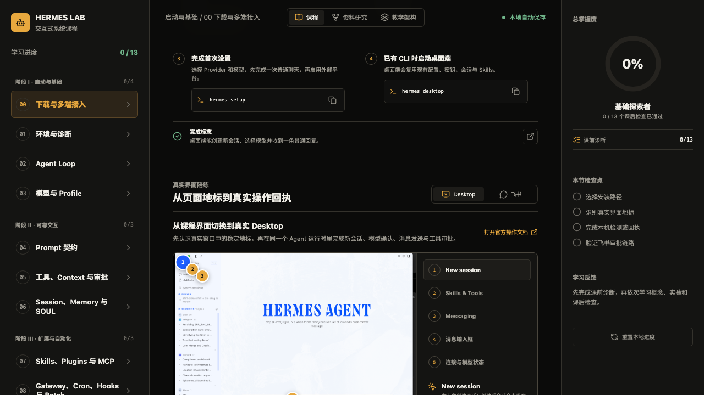
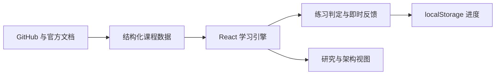

<div align="center">

# Hermes Learning Lab

**从 Agent Loop 到安全委派，一套可以边学边练的 Hermes Agent 中文课程。**

[](https://react.dev/)
[](https://vite.dev/)
[](https://playwright.dev/)
[](#学习路线)
[](#安全边界)

[快速开始](#快速开始) · [学习路线](#学习路线) · [项目研究](./RESEARCH.md) · [设计方案](./DESIGN.md) · [Figma](https://www.figma.com/design/0l0vZa7noe6dyyiOZbakgD?node-id=8-2)

</div>



## 这是什么

Hermes Learning Lab 是一个基于 [Hermes Agent 官方仓库](https://github.com/NousResearch/hermes-agent)、官方文档和已核验社区项目制作的交互式中文入门平台。

它不从长篇概念介绍开始，而是把每个主题组织成一个短学习闭环：

```text
理解概念 -> 观察 Agent 轨迹 -> 在模拟环境中决策 -> 获得即时反馈 -> 记录掌握度
```

> [!NOTE]
> 这是独立的社区教学项目，并非 Nous Research 或 Hermes Agent 的官方产品。

## 功能亮点

| 学习体验 | 工程与安全 |
|---|---|
| 8 节渐进式引导课程 | React + Vite 纯前端架构 |
| 单选、多选和配置构建器 | 所有 Hermes 命令仅模拟展示 |
| Agent 回合轨迹可视化 | 不读取本机配置或凭据 |
| 即时反馈与针对性提示 | 版本化 `localStorage` 进度 |
| 检查点、掌握度与进度重置 | 桌面、平板、手机响应式布局 |
| 官方/社区项目研究视图 | 键盘焦点与语义化控件支持 |

## 学习路线

| 课程 | 主题 | 实践任务 |
|---:|---|---|
| 01 | 认识 Hermes | 为首次写入任务选择审批范围 |
| 02 | 模型与身份 | 配置 Provider 与独立 Profile |
| 03 | 工具与审批 | 组合完成任务所需的最小工具链 |
| 04 | 会话与记忆 | 判断信息应进入 Session 还是 Memory |
| 05 | Skills 与 MCP | 组装可执行的 Skill 结构 |
| 06 | 消息与自动化 | 构建 Gateway + Cron 工作日早报 |
| 07 | 委派与并行 | 识别适合并行分派的独立任务 |
| 08 | 安全毕业挑战 | 组合范围、审批、回滚与验证证据 |

## 快速开始

### 环境要求

- Node.js 18+
- npm 9+

### 本地开发

```bash
git clone https://github.com/ChrysFu-FndVent/hermes-learning-lab.git
cd hermes-learning-lab
npm install
npm run dev
```

Vite 启动后会输出本地访问地址，通常为 `http://localhost:5173/`。

### 质量检查

```bash
npm run lint
npm run build
```

## 技术架构



| 层级 | 职责 |
|---|---|
| Content | 课程、题目、文档链接与开源项目研究 |
| Learning Engine | 练习判定、反馈、课程完成状态与掌握度 |
| Persistence | 使用版本化 schema 保存本地学习进度 |
| UI Shell | 三栏工作台、响应式导航与无障碍交互 |

## 项目结构

```text
hermes-learning-lab/
├── src/
│   ├── App.jsx          # 课程、研究与架构视图
│   ├── data.js          # 课程和项目研究数据
│   └── styles.css       # 视觉系统与响应式布局
├── public/              # 静态视觉资源
├── docs/adr/            # 架构决策记录
├── DESIGN.md            # 产品、交互与技术设计
├── RESEARCH.md          # Hermes 开源生态研究摘要
└── preview.png          # 桌面端成品预览
```

## 安全边界

应用中的命令只用于教学展示。当前版本不会：

- 调用本机 Hermes CLI 或 Shell
- 读取 `~/.hermes`、环境变量或模型凭据
- 写入 Hermes 配置、安装 Skills/MCP
- 连接 Telegram、Discord、Slack 等消息平台
- 向远程服务上传学习进度

浏览器模拟方案的完整取舍见 [ADR 0001](./docs/adr/0001-browser-simulation-first.md)。进入真实环境前，请以当前版本的 [Hermes 官方文档](https://hermes-agent.nousresearch.com/docs/) 为准。

## 研究与设计资料

- [Hermes Agent GitHub 研究摘要](./RESEARCH.md)
- [产品设计、功能模块与用户流程](./DESIGN.md)
- [Figma 概念稿与网页捕获](https://www.figma.com/design/0l0vZa7noe6dyyiOZbakgD?node-id=8-2)
- [Hermes Agent 官方文档](https://hermes-agent.nousresearch.com/docs/)

---

<div align="center">
  <sub>Learn the boundaries. Practise the loop. Ship with evidence.</sub>
</div>
